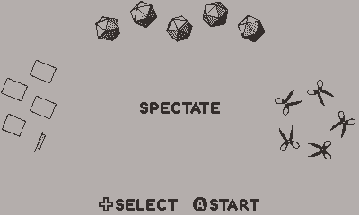
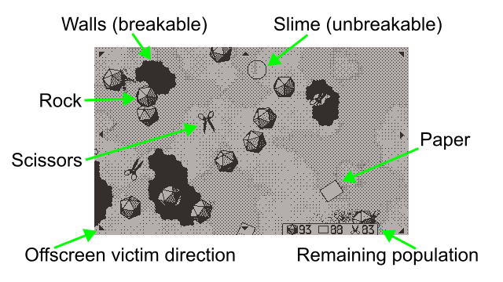

# Rock Paper Scissors

The classic three way game in battle royale style, pitting 99 rocks against 99 papers against 99 scissors until only one team is left.

https://uguu-org.itch.io/rock-paper-scissors

For developer documentation see [dev_readme.md](dev_readme.md).

## Controls

Four modes are selectable by pressing D-pad buttons:

*Spectate*: Watch rocks and papers and scissors fight it out automatically all on their own, no input required.  New game will start automatically after a winner has been determined.  This is the default.

*Tilt to move*: Control rock with the accelerometer.  Hold the console level to make the rock stand still, tilt more to make the rock move faster.

*Move with D-pad*: Control paper with D-pad.  Press a direction button to blow the paper toward that direction.  Mash direction buttons to make it go faster.

*Turn with crank*: Control scissors with crank.  Scissors will move continuously in the direction set by the crank.

Press *A* to start with the selected mode.

## Gameplay

You can select a different object to follow by pressing *A* or *B*.

## Menu options

*Reset*: Go back to mode selection screen.

*Zero tilt*: Set current device orientation to be the zero orientation for interpreting rock inputs.  This may help making rock controls more ergonomic, but note that accelerometer will be more sensitive when the device is physically level.

## FAQ

Q: Why doesn't rock/paper/scissors get killed when they run into paper/scissors/rock?\
A: The kill only happens when a killer runs into a victim.  A victim running into a killer is just a collision.

Q: Why didn't rock/paper/scissors kill the scissors/rock/paper it just ran into?\
A: It grazed the object but didn't hit the center of the collision box.

Q: Why doesn't game end when one of the groups has already been wiped out?  Isn't the outcome already decided when there are only two groups left?\
A: Objects may respawn, if you know where to look.

Q: Why does some games start quickly while others take a while to load?\
A: It depends on how much spare time was available in the previous game to prepare for the next game.

Q: Is it true that scissors has an edge over rocks and papers?\
A: Yes.

