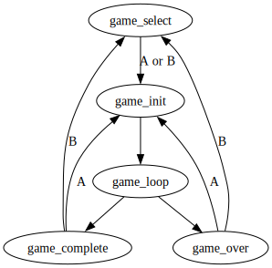
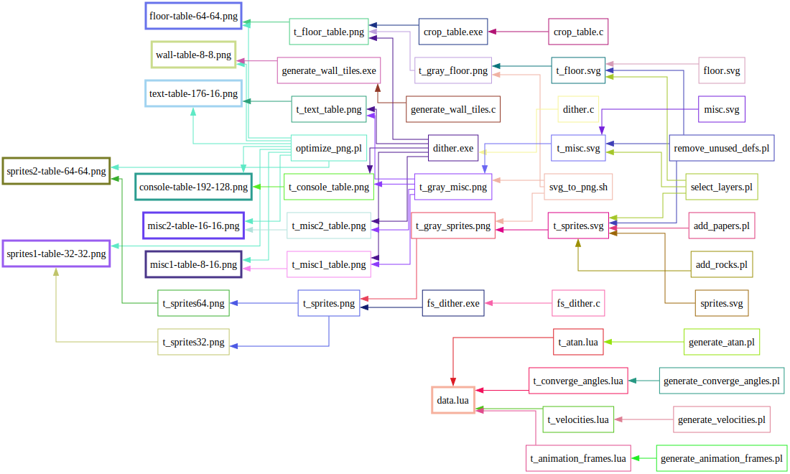

# Developer documentation for Rock Paper Scissors

## Code organization

`source` directory contains all the files needed to build the final zip package.  Look here if you are interested in tweaking game logic.

`data` contains all the files and tools needed to build `source/data.lua` and all the images in the subdirectories.  Look here if you are interested in updating game graphics.

Build environment and toolchain requirements can be found in `Makefile` comments.

## Game states

## Game assets

All game assets are generated from a mixture of SVG and Perl.  Graph for the most of the build pipeline is below:

Not included in this graph are all the build processes for launcher images (animated card, icon, and launch images).  Those are mostly built by cropping and assembling bitmaps from image tables that are used at run time.

## Game logic

Most of the game complications has to do with getting the most performance out of Lua.  I probably should have just gone with C, but there are some development and distribution conveniences when the game is in pure Lua.  Currently I am able to hit 30fps most of the time with all the optimizations, but I might consider porting everything to C if I wanted a 50fps version later.

As to the optimizations, most of them involve reducing amount of time handling collisions.  See comments near `collision_table` and `update_obj` in `main.lua` for more details.

## Debug backdoors

Some extra features are hidden in the game selection screen.  All of them are activated by holding a direction button, and pressing "down" will dismiss the popup window.

**Accelerometer test**: Hold "up" for 3 seconds to activate accelerometer test.  The top numbers are raw accelerometer readings, and the bottom numbers are how they will be interpreted as direction vectors.  "zero" shows the zero orientation that is set by the user via "zero tilt" menu option.

**Crank test**: Hold "right" for 3 seconds to activate crank test.  Top number is raw crank reading, bottom number is the interpreted angle result.

**Population test**: Hold "left" for 3 seconds to activate population test.  This allows the game to start with fewer than the default 99 objects for each group.  Hold direction button and crank to adjust.
